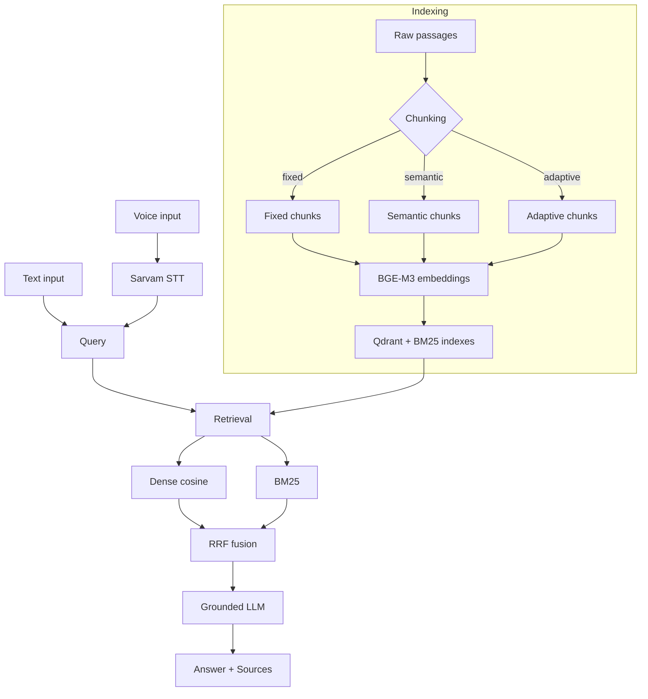

# HH Goa — Voice-Enabled Multilingual RAG

## Overview

HH Goa is a voice-enabled Retrieval-Augmented Generation (RAG) system for
Hindi (extensible to other Indic languages). A user speaks or types a question;
the system transcribes it, retrieves relevant evidence from a Hindi corpus, and
generates a grounded answer attributed to retrieved sources.

The end-to-end pipeline:

```
Voice query → Sarvam STT → transcribed query
  → engineered chunking → BGE-M3 embeddings
  → dense retrieval (Qdrant cosine) + BM25 lexical retrieval
  → RRF hybrid fusion
  → grounded LLM answer + source chunk IDs
```

The experimental corpus is a **deterministic 20,000-query Hindi subset** of
[ai4bharat/MSMARCO-XI](https://huggingface.co/datasets/ai4bharat/MSMARCO-XI),
yielding approximately **200K passage/chunk documents** across three chunking
strategies. This is a subset of MSMARCO-XI, **not** the full dataset. The raw
dataset, embeddings, Qdrant indexes and BM25 pickles are intentionally excluded
from Git (see [Repository Structure](#repository-structure)).

## Key Features

- Hindi voice input via Sarvam speech-to-text
- Speech-to-text using Sarvam (`saaras:v4`)
- Fixed, semantic and adaptive chunking strategies
- BGE-M3 multilingual embeddings (1024-dim)
- Dense vector retrieval (Qdrant, cosine)
- BM25 lexical retrieval (`rank_bm25`)
- RRF hybrid fusion of dense + BM25
- Grounded answer generation (OpenAI-compatible LLM, answers only from context)
- Source attribution (every answer carries retrieved `chunk_id`s)
- Retrieval evaluation (Recall@1/5/10, deterministic stratified queries)
- P50/P70/P100 latency benchmarking (judge methodology)
- Guardrails: empty/insufficient context → refusal (no hallucination); API
  failure → controlled error; source traceability

## Architecture



Text input skips STT and enters at `Query`.

## Dataset

- **Dataset:** `ai4bharat/MSMARCO-XI` (Hugging Face)
- **Experimental subset:** a deterministic 20,000-query Hindi slice producing ~204K chunk rows per chunking strategy
- **Passages:** original document passages from the dataset
- **Chunks:** passages split by a chunking strategy (fixed/semantic/adaptive); a passage may produce one or more chunks
- **Queries:** the 20,000 sampled query rows; ~12,354 have ≥1 human-selected relevant passage (`is_selected == 1`), which is the relevance ground truth for evaluation. `answer`/`answer_en` are **not** used as relevance labels.
- The deterministic subset makes evaluation reproducible across strategies/configs. The raw dataset is downloaded by `scripts/download_dataset.py` and is **not** committed.

## Chunking Strategies

Measured chunk counts (real, from `data/processed/chunks/{strategy}.parquet`):

| Strategy | Description | Chunks |
|---|---|---:|
| Fixed | Overlapping windows of fixed token size | 204,932 |
| Semantic | Sentence-aware boundaries, variable size | 203,621 |
| Adaptive | Sentence-aware with adaptive size by passage length | 204,390 |

## Retrieval

- **Embeddings:** BAAI/bge-m3, 1024-dimensional, L2-normalized (the single
  normalization point; downstream code does not re-normalize). Cosine similarity
  is the dense metric.
- **Dense store:** Qdrant (local mode for the demo; full index on Kaggle). Dense
  Recall@k in evaluation is measured by exact cosine bruteforce over the full
  local `embeddings.npy`, which produces the identical ranking Qdrant returns
  (unit-norm + cosine == dot product), so no Qdrant rebuild is needed to evaluate.
- **BM25:** `rank_bm25.BM25Okapi` with a whitespace + punct-strip + lowercase
  tokenizer (keeps Devanagari words whole; `\w+` regex fragments Hindi).
- **Hybrid:** Reciprocal Rank Fusion (RRF), `score(d) = Σ weight/(k+rank)`,
  default `k=60`.

After experiments (see [Results](#results)), the recommended serving
configuration is **adaptive chunking, dense weight 1.0, BM25 weight 0.25** (a
light BM25 contribution improves Recall@1 and Recall@10 over dense-only;
equal weights hurt).

## Evaluation

100 deterministic stratified queries (seed 12345), relevance = `is_selected==1`.
Dense is exact cosine (== Qdrant ranking).

### Chunking comparison (dense-only)

| Strategy | Recall@1 | Recall@5 | Recall@10 |
|---|---:|---:|---:|
| Fixed | 0.26 | 0.64 | 0.72 |
| Semantic | 0.26 | 0.64 | 0.72 |
| Adaptive | 0.26 | 0.64 | 0.72 |

All three strategies tie on dense recall (the selected passage is found via
cosine similarity regardless of how it is split). Adaptive is chosen as the
serving strategy for principled sentence-aware boundaries.

### Retrieval comparison (adaptive)

| Retrieval | Recall@1 | Recall@5 | Recall@10 |
|---|---:|---:|---:|
| Dense | 0.26 | 0.64 | 0.72 |
| BM25 | 0.09 | 0.27 | 0.33 |
| Best Hybrid (d=1.0, b=0.25) | 0.27 | 0.61 | 0.74 |

BM25 alone is weak on Hindi (lexical exact-match over morphologically rich text).
Hybrid with a **light** BM25 weight beats dense-only at Recall@1 and Recall@10.
Equal-weight hybrid (d=1.0, b=1.0) is worse than dense-only at small k.

## Benchmark

20 timed warm queries (warmup 5, untimed; model/index load untimed), real Qdrant
dense + BM25 + RRF, CPU. Judge methodology: warmup → repeated real queries →
per-stage percentiles.

| Stage | P50 | P70 | P100 |
|---|---:|---:|---:|
| Embedding (query encode) | 219.81 | 265.07 | 543.88 |
| Dense | 278.80 | 300.40 | 553.75 |
| BM25 | 397.88 | 531.02 | 1240.90 |
| RRF | 0.11 | 0.11 | 0.20 |
| Retrieval Total | 928.61 | 1117.47 | 2059.60 |

Latencies in milliseconds. **Current measured latency does not meet the target.**
The official Task 2 target is a full-pipeline (voice → STT → retrieval → answer)
`<200 ms` measured as P50/P70/P100; this table is **retrieval-stage only** and
excludes STT and LLM generation, so no `<200 ms` claim is made. The main
bottleneck is BM25 (P50 ~398 ms, P100 ~1241 ms over the full 204k index).

## Voice Pipeline

```
Voice → Sarvam STT (saaras:v4, hi-IN) → query → retrieval → grounded answer
```

Real measured Sarvam STT latency: **496.2 ms** for the Hindi query
"मैनहट्टन परियोजना क्या थी?" (exact transcription verified). STT is a replaceable
provider (`backend/rag/stt.py`); ElevenLabs could be added later.

## Example

A real query through the pipeline (text path, Phase 7):

**Query:** `मैनहट्टन परियोजना क्या थी?`

**Retrieved sources:** `hi_1185869_p3_c0`, `hi_1185869_p7_c0`, `hi_1185869_p0_c0`,
`hi_1185869_p2_c0`, `hi_1185869_p8_c0` (all `query_id` 1185869 Manhattan Project
passages, RRF score ~0.032).

**Answer (Hindi, grounded):** मैनहट्टन परियोजना द्वितीय विश्व युद्ध के दौरान
(1942-1946) संयुक्त राज्य अमेरिका के नेतृत्व में (यूनाइटेड किंगडम और कनाडा के समर्थन से)
एक अनुसंधान और विकास उपक्रम था, जिसका उद्देश्य पहले परमाणु बम का निर्माण करना था। इस
परियोजना का नेतृत्व यू.एस. आर्मी कोर ऑफ इंजीनियर्स के मेजर जनरल लेस्ली ग्रोव्स के तहत
किया गया था, और परमाणु भौतिक विज्ञानी रॉबर्ट ओपेनहाइमर ने लॉस अलामोस प्रयोगशाला के
निदेशक के रूप में बमों को डिज़ाइन किया था।

Every fact (1942–1946, US+UK+Canada, Groves, Oppenheimer/Los Alamos) traces to
the retrieved sources. Measured (cold, CPU): retrieval ~21.8 s, generation
~14.6 s — cold-start dominated by BGE-M3 load and the LLM round-trip; not
steady-state.

## Repository Structure

```
hh-goa-rag/
├── backend/
│   ├── app.py           # FastAPI app (health, transcribe, query, static SPA)
│   └── rag/             # embeddings, chunkers, qdrant_index, bm25, hybrid,
│                        # evaluation, generation, stt, pipeline, bootstrap
├── scripts/             # download_dataset, chunk/embed/index CLIs,
│                        # retrieve_dense/bm25/hybrid, answer_query, transcribe,
│                        # evaluate_retrieval, benchmark, exp1/exp2,
│                        # push_serve_data (deployment data upload)
├── tests/               # pytest suite (offline, mock-based)
├── docs/                # phase docs + RUNBOOK
├── benchmarks/          # supplied judge benchmark reference
├── frontend/static/     # static SPA (served by FastAPI, no build step)
├── results/             # committed small experiment summaries (JSON + MD)
│   ├── evaluation/      # chunking_comparison, rrf_weights
│   ├── benchmark/       # retrieval_raw, retrieval_summary, retrieval_report
│   └── demo/            # e2e_text_query (real app output)
├── app.py               # HF Spaces entrypoint (re-exports backend.app:app)
├── Dockerfile           # HF Spaces (Docker) — runs the same app on :7860
├── data/                # IGNORED: raw/processed dataset, embeddings, qdrant, bm25
├── requirements.txt
└── README.md
```

The following are **not** committed (`.gitignore`): raw dataset, processed
chunks, embeddings, Qdrant database, BM25 pickle, model weights, `.env`.

## Installation

```bash
git clone <repo>
cd hh-goa-rag
python -m venv venv
source venv/bin/activate
pip install -r requirements.txt
```

Use `venv/bin/python` for all Python commands.

## Environment Variables

The project reads secrets only from environment variables / a project-root
`.env` (never hardcoded). `.env` is git-ignored and must never be committed.

| Variable | Purpose |
|---|---|
| `SARAVAM_API_KEY` | Sarvam STT (note the spelling) |
| `LLM_PROVIDER` | LLM provider: `openai` (default) or `echo` (test mock) |
| `LLM_MODEL` | Model id (defaults to `ANTHROPIC_DEFAULT_SONNET_MODEL` if set, else `gpt-4o-mini`) |
| `LLM_BASE_URL` | OpenAI-compatible base URL (defaults to `ANTHROPIC_BASE_URL` if set) |
| `LLM_API_KEY` | LLM API key (defaults to `ANTHROPIC_API_KEY` / `OPENAI_API_KEY` if set) |
| `STT_PROVIDER` | `sarvam` (default) or `echo` |
| `STT_LANGUAGE` | language code, default `hi-IN` |

## Running

```bash
# tests
venv/bin/python -m pytest tests/ -v

# retrieval evaluation (Recall@1/5/10)
venv/bin/python scripts/evaluate_retrieval.py --n-queries 100

# latency benchmark (P50/P70/P100)
venv/bin/python scripts/benchmark.py --n-queries 50

# text query → grounded answer
venv/bin/python scripts/answer_query.py --query "मैनहट्टन परियोजना क्या थी?" --device cpu

# voice query (audio → text → retrieval → answer)
venv/bin/python scripts/transcribe.py --audio query.wav
venv/bin/python scripts/answer_query.py --query "$(venv/bin/python -c "import json;print(json.load(open('t.json'))['text'])")"

# web app (FastAPI backend + static frontend) — the judge-facing demo
venv/bin/python -m uvicorn backend.app:app --host 0.0.0.0 --port 7860
# then open http://localhost:7860

# experiments
venv/bin/python scripts/exp1_chunking.py --n-queries 100
venv/bin/python scripts/exp2_rrf_weights.py --strategy adaptive --n-queries 100
```

## Web Application

A FastAPI backend (`backend/app.py`) serves a polished static frontend
(`frontend/static/index.html`) — no build step, no Node/npm. The backend
orchestrates the existing phases via `backend/rag/pipeline.py` and caches heavy
components (BGE-M3, BM25, LLM provider) in-process so warm requests reuse them
(the first request may be slow while models load).

### API endpoints

| Method | Path | Body | Returns |
|---|---|---|---|
| GET | `/api/health` | — | `{status, ready, stt_available, guardrail_min_relevance, serving_config}` |
| POST | `/api/query` | multipart: `text` (optional), `audio` file (optional), `top_k` | `{answer, query, language, sources[], timing, guardrail_triggered}` |
| POST | `/api/transcribe` | multipart: `audio` file | `{text, language, provider, latency_ms}` |

`/api/query` uses text if provided (skips STT); otherwise transcribes the audio.
The frontend POSTs to `/api/query` with either a recorded `audio` blob or a text
field. `timing` exposes every stage: `stt_ms`, `encode_ms`, `dense_ms`,
`bm25_ms`, `rrf_ms`, `generation_ms`, `total_ms` — measured live, not fabricated.

### Guardrail

A simple deterministic guardrail in `backend/rag/pipeline.py`: if no retrieved
hybrid candidate has `rrf_score >= RAG_MIN_RELEVANCE` (default `0.005`, env
configurable), the system does **not** generate an answer and returns
_"I couldn't find enough relevant information in the knowledge base to answer
this question."_ The threshold is a real retrieval signal (RRF score), not a
per-query heuristic. For valid queries, generation uses retrieved context only.


## Results

Committed, git-friendly experiment summaries:

- `results/evaluation/chunking_comparison.json` / `.md` — Experiment 1
- `results/evaluation/rrf_weights.json` / `.md` — Experiment 2
- `results/benchmark/retrieval_raw.json`, `retrieval_summary.json`,
  `retrieval_report.md` — Experiment 3

Large artifacts (embeddings, Qdrant, BM25 pickle, model weights, raw dataset,
`.env`, API keys) are **not** committed.

## Limitations

- **Deterministic 20K-query experimental subset** of MSMARCO-XI (not the full dataset).
- **Current measured latency does not meet the <200 ms target** — retrieval-stage P50 ~929 ms (CPU), with BM25 the bottleneck; STT (~496 ms) and LLM generation are additional and not yet included in an end-to-end benchmark.
- **Local Qdrant limitation:** the laptop has a partial (32,756-point) adaptive Qdrant index; the full 204,390-point index exists on Kaggle. Dense latency is measured locally; full-index dense latency should be re-measured on Kaggle. Evaluation recall is valid everywhere (bruteforce dense == Qdrant cosine ranking).
- **7 GB RAM laptop** OOMs when loading BGE-M3 + Qdrant + BM25 + embeddings concurrently on the GPU path; the CPU path and Kaggle (GPU + more RAM) avoid this.
- LLM and STT are external API calls; their latency dominates end-to-end time and depends on the provider.

## Demo

A real end-to-end query through the FastAPI backend (CPU, cold start) is saved as
git-friendly evidence in [`results/demo/e2e_text_query.json`](results/demo/e2e_text_query.json).

**Input:** `मैनहट्टन परियोजना क्या थी?` (text path, `top_k=5`)

**Output (excerpt):**

| Field | Value |
|---|---|
| Answer | मैनहट्टन परियोजना द्वितीय विश्व युद्ध के दौरान (1942-1946) संयुक्त राज्य अमेरिका के नेतृत्व में … रॉबर्ट ओपनहाइमर ने लॉस अलामोस प्रयोगशाला का निदेशकत्व किया। |
| Sources | `hi_1185869_p3_c0` … `hi_1185869_p0_c0` (RRF ≈ 0.032, all `query_id` 1185869) |
| Guardrail | not triggered (best RRF 0.032 ≥ 0.005) |

**Measured latency (cold start, CPU):**

| Stage | ms |
|---|---:|
| Encode | 184.5 |
| Dense | 299.2 |
| BM25 | 2340.2 (cold index load) |
| RRF | 1.4 |
| Generation | 9995.4 (LLM API round-trip) |
| **Total** | **50797.1** |

This is a **cold** run: BM25 is inflated by first index load and generation is an external
LLM API call. Warm steady-state retrieval is ~929 ms (see [Benchmark](#benchmark)). Every
answer fact (1942–1946, US+UK+Canada, Groves, Oppenheimer/Los Alamos) traces to the retrieved
sources — no fabrication.

To reproduce:

```bash
venv/bin/python -m uvicorn backend.app:app --host 0.0.0.0 --port 7860
# open http://localhost:7860  → type the query and press Ask
```

- GitHub repository: https://github.com/Hutej/hh-goa-rag
- Live demo: Hugging Face Space — see [Deployment](#deployment)

## Deployment

The app runs **identically locally and deployed** — same FastAPI code, same
`PROJECT_ROOT/data/processed/...` paths, same `backend.app:app` on port 7860.
Deployment target: **Hugging Face Spaces (Docker)**.

### What the app needs at serve time

The 2.4 G `embeddings.npy` is used only for *indexing*, not retrieval. At serve
time the app needs only the Qdrant index, the BM25 index, and the chunk text:

| Artifact | Size | Purpose |
|---|---:|---|
| `data/processed/qdrant/` | ~373 M | dense retrieval (cosine) |
| `data/processed/bm25/adaptive/bm25.pkl` | ~151 M | lexical retrieval |
| `data/processed/bm25/adaptive/metadata.parquet` | ~57 M | BM25 row metadata |
| `data/processed/chunks/adaptive.parquet` | ~62 M | BM25 rebuild fallback |
| **serve total** | **~643 M** | |

These are gitignored (too large for the code repo). BGE-M3 (~2.2 G) is **not**
bundled — it downloads from the HF Hub at startup and is cached on the Space's
persistent volume.

### Local

```bash
venv/bin/python -m uvicorn backend.app:app --host 0.0.0.0 --port 7860
# open http://localhost:7860
```

### Hugging Face Space (one-time setup, then it just runs)

The code repo (this repository) holds the app; the serve data lives in a
separate HF **dataset repo** that the Space downloads once at startup
(`backend/rag/bootstrap.py`). This keeps the code repo small and makes the data
reproducible.

**1. Push the serve data to a dataset repo (run once, from a machine that has it):**

```bash
export HF_TOKEN=<your write token>
venv/bin/python scripts/push_serve_data.py --repo <user>/hh-goa-rag-data
```

This uploads only the ~643 M serve set (Qdrant + BM25 + chunks), not the 2.4 G
embeddings.

**2. Create the Space** (Docker SDK type), push this repo to it, and set these
**Space secrets** (Settings → Repository secrets):

| Secret | Value |
|---|---|
| `SARAVAM_API_KEY` | Sarvam STT key |
| `OPENAI_API_KEY` | LLM key (OpenAI-compatible) |
| `LLM_BASE_URL` | LLM endpoint (if non-default) |
| `LLM_MODEL` | model id (e.g. `gpt-4o-mini`) |
| `HHGOA_DATA_REPO` | `<user>/hh-goa-rag-data` (from step 1) |

The `Dockerfile` runs `uvicorn backend.app:app --host 0.0.0.0 --port 7860`
(HF Spaces' required port). On first startup `warmup()` sees the serve data is
absent, downloads it from `HHGOA_DATA_REPO` into the persistent `/data` volume,
loads BGE-M3 (cached on the volume), and begins serving. Subsequent restarts
reuse the cached data and model.

### Deployment notes (stated plainly)

- The Space's first build/start is slow: it pip-installs deps, downloads BGE-M3
  (~2.2 G) and the serve data (~643 M). With a persistent volume these are cached
  across restarts.
- `/api/health` reports `serve_data_present` and `ready` so a judge can confirm
  the Space has finished bootstrapping before sending a query.
- The 7 GB-RAM demo laptop OOMs on the **GPU** path; the CPU path (the Space and
  the verified local run) works. On a GPU box with ≥16 GB RAM the GPU path is
  faster; the code auto-selects via `load_embedder`.
- STT and LLM latency depend on the external Sarvam / OpenAI-compatible provider
  and dominate end-to-end time (see [Demo](#demo)).
